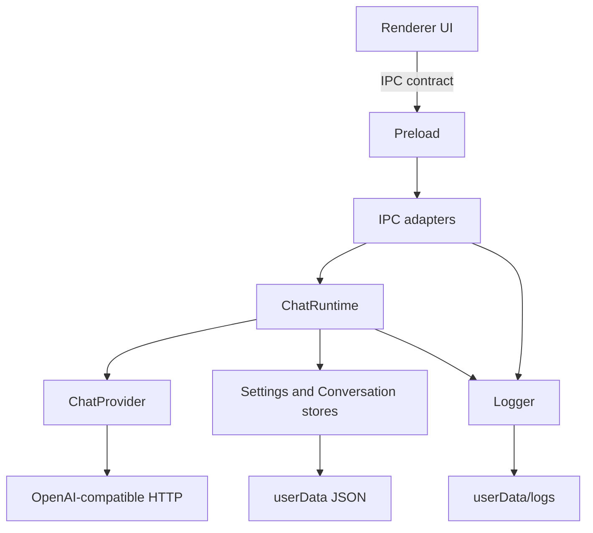

# Anvil 架构

主进程按端口/适配器拆开，方便后面加工具调用、视觉输入和更多 Provider，而不用改 UI。



## 分层

| 层 | 路径 | 职责 |
|---|---|---|
| 协议与领域 | `src/shared` | IPC 频道名、消息/会话规则、错误文案。无 Electron、无 IO。 |
| 运行时 | `src/main/agent` | 一轮对话的编排：落盘、流式、中止。下一步工具循环加在这里。 |
| 端口 | `ChatProvider` / `*Repository` | 可替换的模型与存储接口。 |
| 适配器 | `src/main/providers`、`storage`、`ipc` | OpenAI SDK、JSON 文件、Electron IPC。 |
| 日志 | `src/main/logging` | 结构化文本日志，自动打码 API Key。 |
| UI | `src/renderer` | 只通过 `window.anvil` 说话。 |

组装发生在 [`src/main/index.ts`](src/main/index.ts)，是唯一的组合根。

## 后续迭代挂钩

- **新模型/网关**：实现 `ChatProvider`，不要改 Runtime。
- **工具调用**：在 `ChatRuntime.runStream` 里对 provider 返回的 tool calls 做循环，工具本身再做成端口。
- **视觉**：扩展 `ChatMessage.content` 为文本+图片部件，Provider 已是 OpenAI 协议。
- **排障**：设置页「打开日志目录」，或设环境变量 `ANVIL_LOG_LEVEL=debug`。

## 测试

纯逻辑和适配器都在 `tests/`，不启动 Electron：

```
npm test
```
